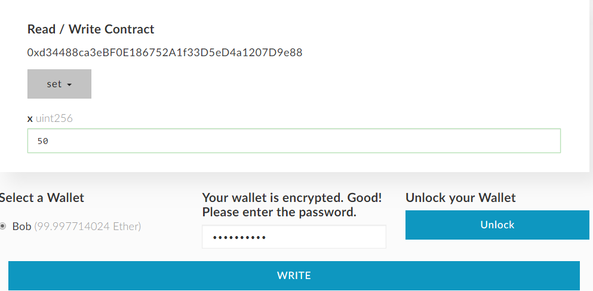

## writing our first contract

In this first tutorial we will create our first contract. For this we have selected some tools, that allow you to 
experiment and interact with the contracts before importing it to the wigo4it blockchain core code where we would 
then do more extensive testing of its features.

We will be programming the contract for Ethereum in a language called solidity.

<p align="center">

</p>

Solidity is a contract-oriented, high-level language for implementing smart contracts. It was influenced by C++,
Python and JavaScript and is designed to target the Ethereum Virtual Machine (EVM).

More information on solidity can be found in this e-book: 
https://media.readthedocs.org/pdf/solidity/develop/solidity.pdf


## Prerequisites
 
* __Ganache__
  <br/>Creates a private blockchain on your machine. You can install Ganache from here: http://truffleframework.com/ganache/
* __MyEtherWallet__
  <br/> You need a wallet. You can either run it as a stand alone wallet or download it as a chrome extension. https://github.com/kvhnuke/etherwallet/releases
   we will using the chrome extension.
* __Solidity Remix__
  <br/> Finally we can browse to an online solidty contract editor called Remix. Remix can be found at: https://remix.ethereum.org/

## Setting up our Wallet and private Blockchain Node

Open up your EtherWallet by clicking on the EtherWallet chrome extension icon that now appears in your chrome browser.

#### Pointing our Wallet to Ganache

Now open up Ganache and you should see the RPC server settings.


We are going to put this address into our MyEtherWallet so it sees our private network.


Go ahead and click on "Add Custom Node". Then we fill in the screen that appears with the information.


Go ahead and click on "Save & Use us the custom node. The node should now be listed and an active connection 
has been made to it by MyEtherWallet" 

## Writing and compiling our contract

Copy and paste the following code in the remix editor:

```javascript
pragma solidity ^0.4.0;

contract SimpleStorage {	

	uint storedData;

	function set(uint x) public {
		storedData = x;
	}

	function get() public constant returns (uint) {
		return storedData;
	}
}
```

Now compile the code in the remix editor by clicking "Start to compile" button.
Once compiled, click the [copy icon] to copy the bytcode in the appearing screen.

From Genache klik on thee "Key" icon from the first address, a screen will apear
showing the public and private key of this account.


In MyEtherWallet go to "Add Wallet". And select "Private Key". Now copy the private
key from Ganache using ctrl-c, and paste it using ctrl-v in the private key
text box.


Now unlock the wallet. And fill in a name for the wallet "Bob" and a password


Now add the wallet. 


Now past in the Deploy contract screen in MyEtherWallet and filter out the bytecode


Now scroll down and import the previously added account "Bob" to upload the contract with.
By default Genache charges a small amount of ETH to deploy the contract. When going back
to Bobs Wallet in MyEtherWallet you can see Bobs new ETH balance.


When going back to Ganache, as it is auto mining the contracts, you now see there is 1 TX-COUNT
for Bob.


__!Note__: You don't see a balance difference in Genache, as the it is rounded on two 
decimals.

Head to Ganache to Copy the "Created Contract Address" to let us interact with the contract.


Go to MyEtherwallet "Interact With Contract", enter the address from Ganache, then go to remix
and copy the ABI.

In Remix:


Resulting Screen in MyEtherWallet


Click "Access", Enter a number to writ to bobs wallet by selecting it, unlock it.



Click write, follow the logical steps to make the transaction.

Now back in Ganache we can find the transaction in Block #2


The value we set on a property of the solidity contract was 50 (this is not 50 ETH, but
a value stored on the blockchain. We can see this in 32 hex at the end of the TX data string in
Ganache.

We can go back to the interact with contract screen, this time not do a SET but a GET which should
return 50.


And there you have it, your first contract that writes a setting to to blockchain.
Ofcourse these manual steps can be automated, which is what we are going to do when writing
more complex contracts in the next tutorials.


