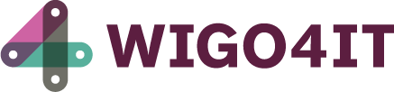

 
  

# Blockchain Hackathon

https://github.com/wigo4it/blockchain-hackathon is the official open source repository for our blockchain events.

Social services in the Netherlands have launched an offensive with the aim of improving service provision towards customers. This can be done by reducing bureaucracy and working in a more customer-oriented manner, amongst other things. ICT plays a crucial part in this.

The most noticeable initiative in this area is that taken by the four largest Dutch municipalities: Amsterdam, Rotterdam, Utrecht and The Hague. The social services of this G4 have joined forces to form the cooperation Wigo4it: an acronym for the Dutch words Werk, Inkomen, G4, voor Informatietechnologie, which mean work, income, G4, for information technology.

Within the context of the Work and Social Assistance Act (Wwb), the G4's combined social services are responsible for a third of all people entitled to benefits. Wigo4it also provides support in the health-care policy area.

# Current Status

Currently we are building the Core components, the core should be agnostic but is initially build to support Ethereum.

# Development methods and toolchain 

For the hackathons we use the following toolset:

* Feature driven development
  * Use of Personas in Specflow / Gherkin
* Microsoft .NET c#
* Visual Studio 2017 and Visual Studio code IDE
* Blockchain technology
  * <a href="hhttps://github.com/Nethereum/" title="NETHEREUM">NETHEREUM</a> (TestRPC for testing)
  * <a href="https://github.com/SmartIdentity/smartId-contracts" title="Smart Identity">Smart Identity</a> contracts
  * <a href="https://github.com/Nethereum/abi-code-genabi-gen" title="abi-code-gen">abi-code-gen</a> for binding .NET to solidity smart-contracts 

# Personas

Hackaton challenges inherently develop our personas on the blockchain. Personas enable us to model complex processes as progress around feature driven development. Although it's unknown at this time what the challenges will be, they will be focussed around social development within the three work domains WIGO4IT operates in, being: Care, Work and Income.

As a precondition, each persona is setup with at least their picture, first name and and Ethereum address.

| Persona                                                       | Name               | Address
|:--------------------------------------------------------------|:------------------:|:----------------------------------------:|
|     | Richard            | 0c143223caf511e7ea6244d3734d2953a2981789 |
|       | Jahir              | 29bd0d7cef97ff8072f3c3ddd72890dcf9f3b22b |
|       | Alice              | 3027dd3634718bb8a0941b84909a127fed8dadea |
|     | Sabella            | 7b5a158d2efd4585f2976bf1e53acade71b86e13 |
|         | Bob                | 28b0417e79c780cb6cb79fc304e345cd21161e28 |
|       | Eline              | 870b873ff72be8aadd9e616d6299fd0a36102c71 |

# Credits

Wallet icons made by <a href="https://www.flaticon.com/authors/pixel-buddha" title="Pixel Buddha">Pixel Buddha</a> from <a href="https://www.flaticon.com/" title="Flaticon">www.flaticon.com</a> is licensed by <a href="http://creativecommons.org/licenses/by/3.0/" title="Creative Commons BY 3.0" target="_blank">CC 3.0 BY</a>

Persona icons made by <a href="https://www.linkedin.com/in/svanleeuwen/" title="Sjef van Leeuwen">Sjef van leeuwen</a> from <a href="https://www.wigo4it.nl/" title="WIGO4IT">www.wigo4it.nl</a> is licensed by <a href="http://creativecommons.org/licenses/by/3.0/" title="Creative Commons BY 3.0" target="_blank">CC 3.0 BY</a> using Avatar Creator

